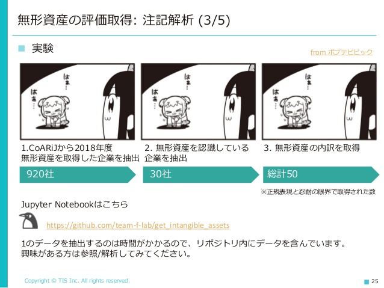

# Get Intangible Assets

有価証券報告書の企業結合等の注記から無形資産の読み取りを行うデモです。

発表資料: [財務・非財務一体型の企業分析に向けて](https://www.slideshare.net/takahirokubo7792/ss-230730283)

## Process

1. [CoARiJ](https://github.com/chakki-works/CoARiJ)から2018年度無形資産を取得した企業を抽出
    * こちらは時間がかかるため、Amazon SageMakerを使用して別途処理しています。
    * 全件のデータを`data/raw/intangibles.csv`に格納しています。各企業の注記HTMLと無形資産取得額が収録されています。
2. 無形資産を認識している企業を抽出
    * "のれん以外"の記述がある企業を抽出しています。
3. 無形資産の内訳を取得
    * 頑張って注記の内訳を取得しています。

2, 3の処理を以下のNotebookで行っています。

[get_intangible_asset.ipynb](https://github.com/team-f-lab/get_intangible_assets/blob/master/notebook/get_intangible_asset.ipynb)
